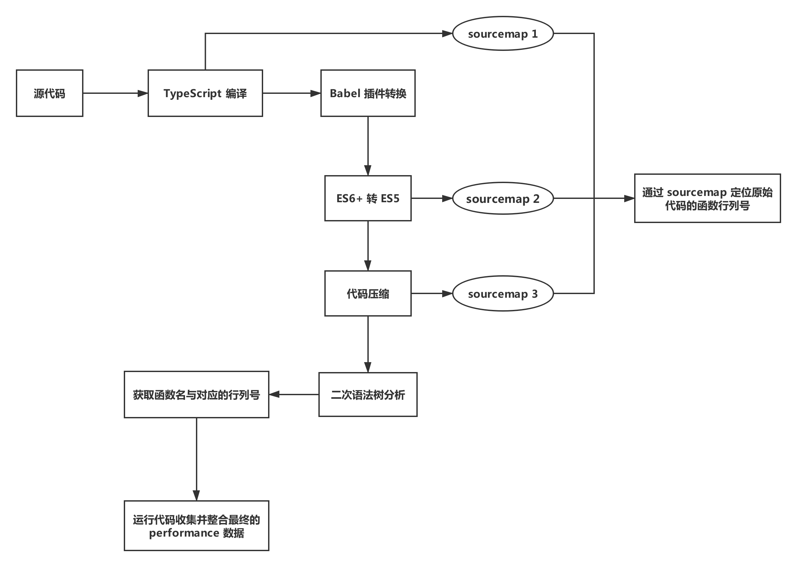

编译器
-----

说起编译原理，可能我们脑海中首先浮现的就是 “编译器” 这个词汇。维基百科上对编译器的定义是：**编译器是一种计算机程序，它会将某种编程语言写成的源代码（原始语言）转换成另一种编程语言（目标语言）。** 通常一个编译器的编译过程会经过词法分析、语法分析、语义分析、生成中间代码、优化、生成目标代码这几个阶段。如果将其简要概括，则只包含 **解析 ( parse ) 、转换 ( transform ) 、生成 ( generate )** 这三个阶段。

* 解析 ( parse ) 是将原始代码转换为更为抽象的表达形式，在这个阶段编译器会对原始代码进行词法分析、语法分析、语义分析并最终生成[**抽象语法树 ( AST )**](https://zh.wikipedia.org/wiki/抽象語法樹) 。例如，[ESTree](https://github.com/estree/estree) 就是 JavaScript 的 AST 规范。
* 转换 ( transform ) 让我们可以在同一种语言下操控 AST ，也可以将它翻译为另一种语言的 AST 。
* 生成 ( generate ) 阶段则是将转换后的 AST 翻译为目标代码的过程。

如果想要了解一个简单的编译器是如何实现的，可以看看 [**The Super Tiny Compiler**](https://the-super-tiny-compiler.glitch.me/) 。

转译器
-----

既然讲到了编译器 ( compiler ) ，就不得不提与它概念十分相近的转译器 ( transpiler ) 。**转译器其实是一种特殊的编译器，它用于将一种语言编写的源代码转换为另一种具有相同抽象层次的语言。** 例如，能够将 TypeScript 转换为 JavaScript 的 tsc 转译器以及能够将 ES6+ 转换为 ES5 的 Babel 转译器。从这里我们也可以看出编译器与转译器最大的区别就在于编译器是将高级语言转换为低级语言（例如汇编语言、机器语言），转译器则是相同抽象层次间的语言转换。

领域特定语言
-----

Ruby 之父松本行弘在《代码的未来》一书中对领域特定语言 ( Domain Specific Language ) 有着这样的解释：

> 所谓 DSL ，是指利用为特定领域 ( Domain ) 所专门设计的词汇和语法，简化程序设计过程，提高生产效率的技术，同时也让非编程领域专家的人直接描述逻辑成为可能。DSL 的优点是，可以直接使用其对象领域中的概念，集中描述 “想要做到什么” ( What ) 的部分，而不必对 “如何做到” ( How ) 进行描述。

但 DSL 这个概念最早是由 Martin Fowler 提出，他把 DSL 分为内部 DSL 和外部 DSL ，而实现外部 DSL 的理论基础就是编译原理。我们知道如果将计算机编程语言按抽象层次划分可以分为高级语言、汇编语言以及机器语言。DSL 则是基于高级语言之上的抽象层次。上文提到的 TypeScript ，ES6+ 以及 React 中的 JSX 、Vue 中的 Template 、基于 Node.js 的模版引擎 ejs / jade / nunjucks 等等。从某种层面上来讲，它们都可以被叫做 DSL 。

如果想要具体了解 DSL 是什么，可以看看[**这篇文章**](https://juejin.im/post/5a3de2225188252b145b4000)。

理解 Babel 插件机制
-----

在讲了这么多概念之后，相信读者很容易就可以理解什么是 Babel 插件。从上文中我们知道 Babel 其实就是一个转译器，它会将 ES6+ 语法的代码解析为 AST ，通过对 AST 中节点的增加、删除、更改将其转换为符合 ES5 规范的 AST ，最终将转换后的 AST 翻译为 ES5 代码。下图展示了这个过程：

Babel 的主要作用是 ES6+ 转 ES5 ，但若只有这一个功能，肯定不能够满足开发者的需求。而 Babel 插件机制则能够让开发者涉足转换 ( transform ) 阶段，通过 Babel 提供的相关 API 操纵 AST ，并将原始代码最终转换为我们想要的目标代码。

编写 Babel 插件的前提
-----

想要编写一个可用的 Babel 插件，是需要很多前置知识的。首先我们得理解基于 [ESTree](https://github.com/estree/estree) 的 AST 语法规范，通过 [AST Explorer](https://astexplorer.net/) 我们可以实时查看某段代码生成的 AST ，对不同类型的节点对象有更加深刻的认识。在理解 AST 其实就是用来描述代码的一种抽象形式后，我们还需要学习如何对 Babel 生成的 AST 进行增加、删除和更改。在这里推荐 [Babel Plugin Handbook](https://github.com/jamiebuilds/babel-handbook/blob/master/translations/en/plugin-handbook.md) ，里面完整地讲解了如何去写一个 Babel 插件，细读两遍之后写一个简单的 Babel 插件基本不在话下。在编写 Babel 插件时，我们往往会用到以下几个 npm 包：

* **@babel/parser** 
  *  将原始代码转换为能够让 Babel 操纵的 AST 。
* **@babel/traverse** 
  * 能够遍历 AST ，维护着整棵树的状态，并且负责替换、移除和添加节点。
* **@babel/types**
  * 是一个用于 AST 节点的 Lodash 式工具库。它包含了构造、验证以及变换 AST 节点的方法，对编写处理 AST 逻辑非常有用。
* **@babel/generator**
  * 将转换后的 AST 翻译为目标代码。

开始编写 Babel 插件
-----

在这里我们以实现函数的性能分析功能为例，最终完成一个能够收集函数名、函数耗时以及函数对应行列号的 Babel 插件。它的基本原理其实就是在 Babel 遍历 AST 时，通过对 AST 节点的增加、删除和更改，在每个有效函数的首尾插入我们的打点代码，之后我们还会收集函数名和函数对应的行列号，最后在代码运行时收集函数耗时的相关数据。下图展示了与实现该 Babel 插件相关的整个流程：

可以看到想要实现这个功能其实是有以下几个难点的：

1. 如何定义相关的数据格式使得最终收集到的函数数据正确。
2. 如何插入打点代码，对于异步函数 ( async / await 、generator ) 又该怎样处理。
3. 原始代码在经过一系列的转换后，每一步都会生成相应的 sourcemap ，如何根据最终文件生成的 sourcemap 找到原始代码并进行调试。
4. 如何减少 Babel 对 AST 的遍历以及操作次数，从而减少 Babel 插件的运行时间。

