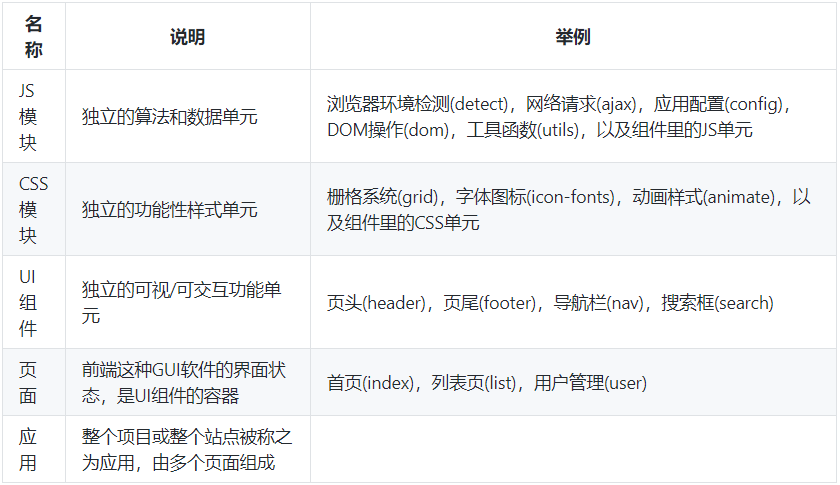
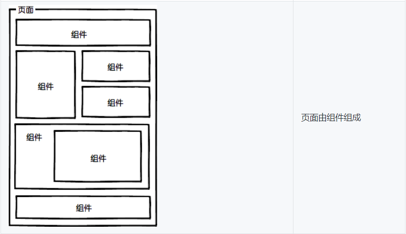
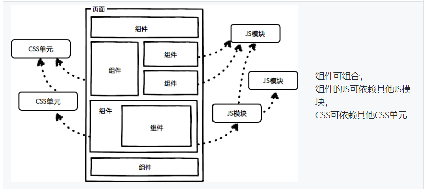
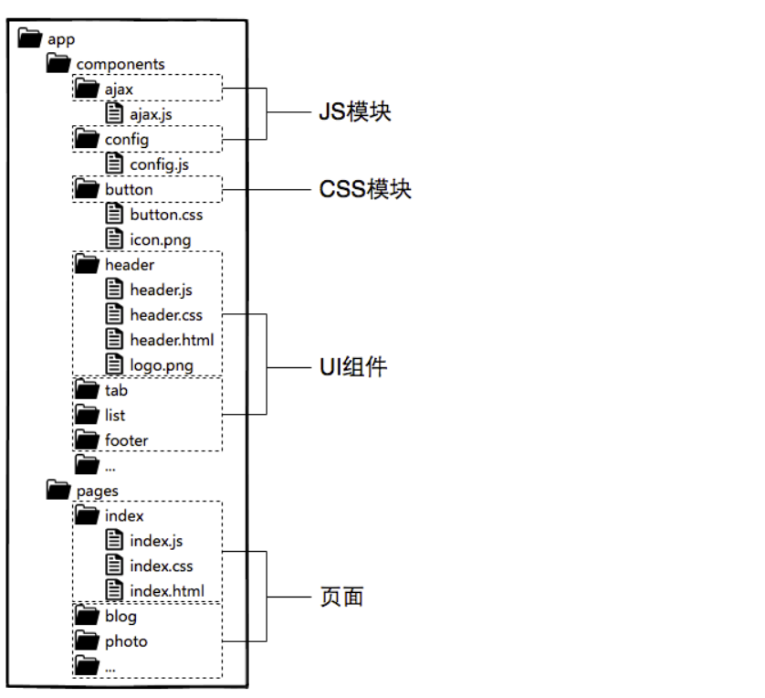

> ### 前端工程基础概览

##### 前端集成解决方案 ( Front-end Integrated Solution )  简称 FIS

1. 开发规范
2. 模块化开发
3. 组件化开发
4. 组件仓库
5. 性能优化
6. 项目部署
7. 开发流程
8. 开发工具

##### 前端工程的三个阶段

1. 库 / 框架的选型
2. 简单构建优化
3. JS / CSS 模块化开发
4. 组件化开发与资源管理

##### 前端工程中的一些问题

* 大体量
  *  多功能、多页面、多状态、多系统

* 大规模
  * 多人甚至多团队合作开发

* 高性能
  * CDN部署
  * 缓存控制
  * 缓存复用
  * 按需加载
    * 预加载
    * 延迟加载
    * 同步 / 异步加载
  * 文件指纹
  * 请求合并

  * App Shell 骨架屏

##### 前端组件化开发理念

1. 页面上的每个独立可视 / 可交互区域视为一个组件
2. 每个组件对应一个工程目录, 组件所需的各种资源都在这个目录下就近维护
3. 由于组件具有独立性, 因此组件与组件之间可以自由组合
4. 页面只不过是组件的容器, 负责组合组件形成功能完整的界面
5. 当不需要某个组件, 或者想要替换组件时, 可以整个目录删除 / 替换

##### 前端开发概念与基本工程结构

> ##### PS : 互联网产品开发基本流程

1. 需求讨论
2. PRD ( 产品需求文档 ) 评审
3. UI 评审
4. 前后端协同阻塞节点
   * 系统设计
   * 接口设计
   * 接口 mock
5. 代码开发
6. 单元测试
7. 集成测试
8. 产品验收
9. 灰度发布
10. 产品上线

##### 参考文章

[前端工程 ~ 基础篇](https://github.com/fouber/blog/issues/10)

